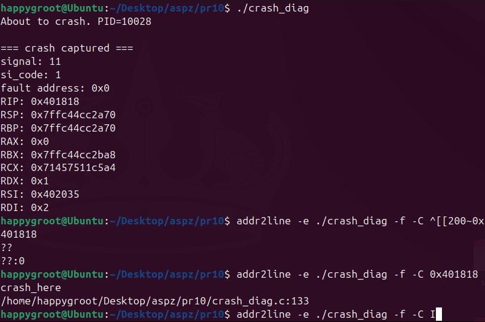
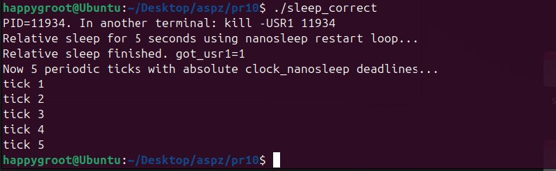
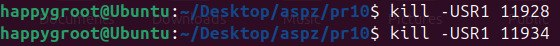
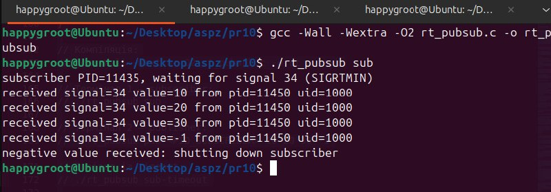
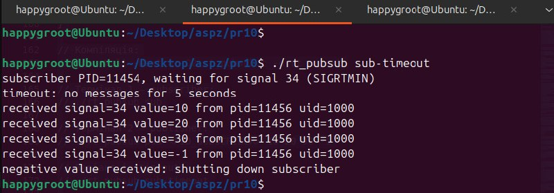
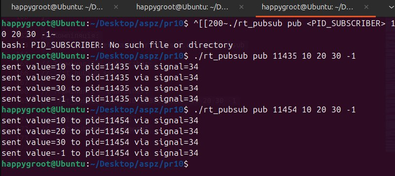
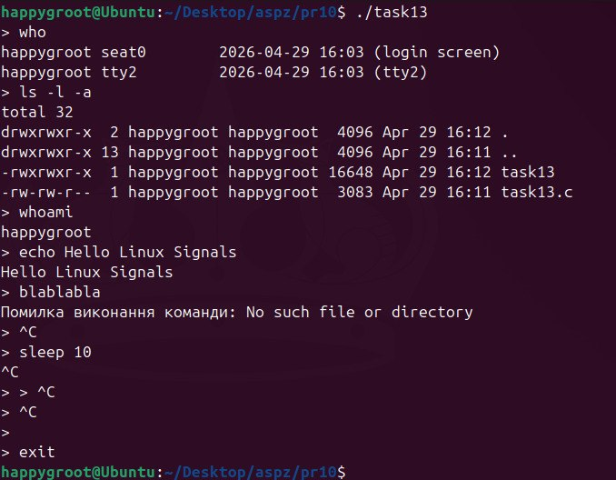

# Практична робота 10

---

## Завдання 1: Перехоплення фатальних помилок (crash_diag.c)

**Опис:**
Програма демонструє перехоплення фатальних помилок за допомогою обробників сигналів.

**Пояснення:**
Програма демонструє перехоплення фатальних помилок за допомогою обробників сигналів. У функції main викликається install_crash_handlers(), яка через sigaction призначає функцію crash_handler на критичні сигнали (SIGSEGV, SIGBUS, SIGFPE, SIGILL, SIGABRT). Використовуються прапорці SA_SIGINFO для отримання розширеної інформації та SA_RESETHAND для скидання обробника після спрацьовування. Далі викликається функція crash_here(), яка навмисно записує значення за нульовою адресою, генеруючи сигнал SIGSEGV (Segmentation fault). Її атрибут noinline гарантує, що компілятор не вбудує цю функцію в main, зберігши її унікальну адресу.

Після крашу система перериває виконання і передає управління в crash_handler. Всередині нього не використовується printf, оскільки ця функція не є async-signal-safe і може спричинити дедлок. Замість неї застосовані кастомні функції wr_*, які напряму роблять системний виклик write у стандартний потік помилок STDERR_FILENO. Обробник виводить номер сигналу, код помилки si_code, адресу пам'яті si_addr та витягує з параметра контексту дамп регістрів процесора архітектури x86-64. Програма примусово завершується викликом _exit зі стандартним кодом повернення 128 плюс номер сигналу.

В результаті виконання програми отримано такі дані. Рядок signal: 11 підтверджує генерацію сигналу SIGSEGV через спробу доступу до забороненої ділянки пам'яті. Значення fault address: 0x0 вказує, що збій стався саме через спробу запису за нульовою адресою. Програма успішно перехопила власний краш і витягла з регістра RIP адресу поточної машинної інструкції в момент падіння, яка склала 0x401818.

Для правильної роботи утиліт програма компілюється командою: gcc -Wall -Wextra -O0 -g -fno-omit-frame-pointer -no-pie crash_diag.c -o crash_diag. Параметри -Wall та -Wextra вмикають максимальний показ попереджень під час компіляції. Прапорець -O0 вимикає будь-які оптимізації, щоб адреси інструкцій чітко відповідали рядкам коду. Параметр -g додає в бінарний файл відлагоджувальні символи для зв'язування машинного коду з рядками на C. Прапорець -fno-omit-frame-pointer забороняє компілятору використовувати регістр RBP для загальних цілей, залишаючи його як вказівник на початок поточного кадру стека. Параметр -no-pie вимикає рандомізацію адрес, завдяки чому адреси функцій та інструкцій в пам'яті є статичними і не змінюються при кожному запуску.

Після запуску файлу ./crash_diag та генерації дампу використовується утиліта addr2line для перетворення адреси інструкції назад у зрозумілий рядок коду. Це робиться командою: addr2line -e ./crash_diag -f -C 0x401818. Параметр -e вказує шлях до скомпільованого файлу з відлагоджувальними символами, -f вимагає вивести ім'я функції, а -C розшифровує її назву. Виклик із чистою адресою 0x401818 успішно перетворив її у назву функції crash_here та вказав точний рядок коду 133, де сталася помилка.

**Скріншот:**

**Висновок:**
Програма успішно демонструє перехоплення фатальних помилок за допомогою обробників сигналів. Використання `sigaction` з `SA_SIGINFO` дозволяє отримати розширену діагностику падіння процесу. Навмисний `SIGSEGV` через запис у `NULL` адресу дозволив протестувати механізм аварійного завершення. Рядок `signal: 11` підтверджує `SIGSEGV`, а `fault address: 0x0` підтверджує звернення до нульової адреси. Утиліта `addr2line` успішно відновлює функцію `crash_here` та рядок коду.
Цей підхід є критично важливим при розробці високонавантажених або системних програм (серверів, демонів) для автоматичного збору crash-дампів та логування точних причин падіння перед завершенням процесу, що значно пришвидшує подальший дебагінг.

---

## Завдання 2: Призупинення виконання процесу та таймери (sleep_correct.c)

**Опис:**
Програма демонструє правильні способи призупинення виконання процесу за допомогою відносного та абсолютного таймерів з коректною обробкою сигналів.

**Пояснення:**
Програма демонструє правильні способи призупинення виконання процесу за допомогою відносного та абсолютного таймерів з коректною обробкою переривань від сигналів. У функції main налаштовується обробник on_usr1 для сигналу SIGUSR1, який при отриманні змінює значення прапорця got_usr1. Далі викликається функція sleep_relative_ms, яка призупиняє процес на 5 секунд за допомогою системного виклику nanosleep. Якщо під час сну програма отримує сигнал SIGUSR1, виклик переривається з помилкою EINTR, але завдяки циклу while програма зчитує залишок часу зі змінної rem і знову викликає nanosleep, гарантуючи сумарно необхідні 5 секунд сну. Після цього демонструється періодичне виконання за допомогою абсолютного таймера clock_nanosleep з прапорцем TIMER_ABSTIME. Якщо цей виклик переривається сигналом, він повторюється з тим самим абсолютним дедлайном, що повністю запобігає накопиченню часової похибки.

В результаті виконання програми отримано очікувану поведінку. Після запуску програма вивела свій PID та інструкцію для відправки сигналу. Далі вона розпочала відносний сон на 5 секунд. В цей час з іншого термінала було надіслано сигнал kill -USR1 PID. Програма успішно перехопила сигнал, не перервала свою основну роботу, доспала залишок часу і вивела повідомлення Relative sleep finished. Змінна got_usr1 змінила своє значення на 1. Після цього програма перейшла до використання абсолютного таймера і рівномірно вивела 5 повідомлень tick з інтервалом рівно в одну секунду.

Компіляція:
`gcc -Wall -Wextra -O2 sleep_correct.c -o sleep_correct`

**Скріншот:**

**Висновок:**
Реалізовано надійні механізми відносного та абсолютного таймерів з коректною обробкою переривань (`EINTR`) від сигналів. Доведено, що використання `clock_nanosleep` з абсолютним часом унеможливлює накопичення часової похибки, гарантуючи точність.
Такі таймери необхідні для написання систем реального часу та програм, що потребують суворої періодичності виконання незалежно від зовнішніх переривань, наприклад, для регулярного опитування IoT-датчиків (температури, освітленості), збору системних метрик або керування автоматикою.

---

## Завдання 3: Міжпроцесна взаємодія (rt_pubsub.c)

**Опис:**
Програма демонструє модель видавець–підписник через сигнали реального часу.

**Пояснення:**
Програма демонструє міжпроцесну взаємодію за моделлю видавець-підписник з використанням сигналів реального часу. Основна суть полягає в передачі не лише самого факту події, а й корисного навантаження між незалежними процесами.

У функції subscriber обраний сигнал спочатку блокується викликом sigprocmask. Це обов'язкова умова, яка запобігає асинхронній доставці сигналу системним обробником. Після цього процес синхронно очікує на надходження події за допомогою sigwaitinfo, або sigtimedwait, якщо активовано режим з таймаутом. Функція publisher у циклі перебирає передані числові аргументи і відправляє їх підписнику системним викликом sigqueue. Головна особливість сигналів реального часу порівняно зі звичайними полягає в тому, що вони не об'єднуються і не втрачаються при швидкій відправці, а гарантовано стають у чергу ОС, зберігаючи передане цілочисельне значення у структурі siginfo_t.

Компіляція виконується командою gcc -Wall -Wextra -O2 rt_pubsub.c -o rt_pubsub, де прапорці вмикають усі попередження для контролю якості та базову оптимізацію коду.

В результаті виконання в консолі отримано очікувану взаємодію двох процесів. Спочатку підписника запущено командою ./rt_pubsub sub. Програма вивела свій PID 11435 і почала очікувати на базовий сигнал реального часу номер 34 (SIGRTMIN). В іншому терміналі видавець виконав ./rt_pubsub pub 11435 10 20 30 -1, миттєво відправивши чотири значення поспіль. Підписник по черзі витягнув усі значення з черги, відобразивши їх разом із PID та UID відправника. При отриманні від'ємного числа -1 спрацювала закладена логіка завершення, і підписник штатно вимкнувся.

Далі було перевірено другий сценарій командою ./rt_pubsub sub-timeout. Підписник отримав новий PID 11454. Оскільки видавець не відправив дані одразу, системний виклик sigtimedwait через 5 секунд перервався з кодом помилки EAGAIN. Програма перехопила це, вивела повідомлення timeout: no messages for 5 seconds і відновила очікування. Коли видавець врешті відправив набір сигналів цільовому PID, підписник миттєво обробив чергу з числами 10, 20, 30 і -1, після чого успішно завершив роботу.

**Скріншот:**

**Висновок:**
Успішно перевірено роботу моделі видавець-підписник на базі сигналів реального часу POSIX. На відміну від стандартних сигналів, сигнали реального часу стають у чергу та дозволяють передавати додаткове цілочисельне навантаження без втрати даних при інтенсивній відправці.
Цей метод відмінно підходить для організації легковагового асинхронного зв'язку (IPC) між процесами. Наприклад, для передачі коротких статусних кодів чи ідентифікаторів подій від робочих (worker) процесів до головного (master) процесу без необхідності розгортати складні черги повідомлень чи сокети.

---

## Завдання 4: Створення власної оболонки (Task 13)

**Опис:**
Створення власної командної оболонки з використанням fork() та execvp().

**Пояснення:**
дана програма це безкінечний цикл ( while(1) ), в якому ми чекаємо вводу тексту від користувача, далі відбувається парсинг за допомогою функції strtok, вона розбиває рядок на окремі слова (за пробілами). Перше слово стає командою, а решта аргументами. Оболонка використовує зв'язку fork() та execvp(). Форк робить точну копію нашої оболонки (дочірній процес), а сама оболонка (батьківський процес) викликає waitpid() і засинає, поки нащадок не зробить свою роботу

далі дочірній процес викликає execvp(), замінюючи код дочірнього процесу на код викликаної програми ( типу ls ), коли ls відпрацює, дочірній процес знижується, а батьківський прокидається і знову показує запрошення.

На початку коду було змінено реакцію сигнала SIGINT (CTRL + C), замість стандартного завершення, програма викликає функцію handle_sigint ( яка просто малює нове > ), тому оболонка ігнорує спроби її закрити цим шорткатом.

Всередині дочірнього процесу ми повертаємо стандартну реакцію на сигнал signal(SIGINT, SIG_DFL), тому якщо висить команда sleep 10 і ми тиснемо CTRL+C, сигнал вбиває саме дочірній процес (sleep), батько бачить, що нащадок вмер, і продовжує свій цикл.

exit працює бо це вбудована команда

**Скріншот:**

**Висновок:**
Продемонстровано роботу базового механізму командної оболонки. Закріплено розуміння роботи системних викликів `fork` для створення процесів та `execvp` для підміни їх образу. Додатково ізольовано обробку сигналів: оболонка ігнорує переривання, захищаючи свій цикл, тоді як дочірні процеси можуть бути штатно завершені.
Глибоке розуміння створення та управління процесами є фундаментом системного програмування. Ці навички застосовуються при створенні систем управління процесами, налаштуванні обмежень ресурсів у контейнеризації (наприклад, Docker), а також при написанні скриптів-наглядачів для автоматичного перезапуску сервісів.
