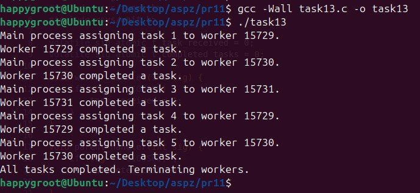

## Практична робота 11: Міжпроцесна взаємодія та управління сигналами

---

### Завдання 13: Багатопроцесна модель розподілу завдань за допомогою сигналів

**Опис:**
Реалізація архітектури "master-worker", де головний процес керує пулом дочірніх процесів та синхронізує їхню роботу, використовуючи механізм асинхронних POSIX-сигналів.

**Пояснення:**
Дана програма створює один батьківський та 3 дочірні процеси (робітники) за допомогою функції fork(). Для синхронізації та зв'язку між ними використовуються користувацькі сигнали: батько налаштовує обробник для SIGUSR2, а нащадки — для SIGUSR1.

Всередині нескінченного циклу while(1) кожен робітник викликає pause() і засинає, очікуючи на сигнал. Головний процес по черзі (за допомогою остачі від ділення) розподіляє 5 завдань, надсилаючи обраному робітнику сигнал SIGUSR1 функцією kill(). Після цього батько також входить у pause(), чекаючи завершення поточного завдання.

Коли дочірній процес отримує SIGUSR1, він прокидається, імітує роботу за допомогою sleep(1), виводить повідомлення про виконання і надсилає батьку сигнал SIGUSR2. Цей сигнал пробуджує головний процес і збільшує лічильник completed_tasks, після чого батько переходить до призначення наступного завдання. Завдяки цьому завдання виконуються строго послідовно.

Після завершення циклу з 5 завдань, батьківський процес надсилає сигнал SIGTERM усім робітникам, щоб перервати їхні нескінченні цикли та вбити їх. Далі він викликає waitpid() для кожного з них, щоб очистити ресурси системи від дочірніх процесів, і завершує свою роботу.

**Скріншоти:**

**Висновок:**
Успішно реалізовано базовий механізм міжпроцесної взаємодії (IPC). Комбінація сигналів та системного виклику `pause()` дозволяє створювати ефективні системи диспетчеризації: процеси не витрачають процесорний час на постійні перевірки (busy waiting), а перебувають у стані очікування до моменту настання конкретної події, що оптимізує використання ресурсів операційної системи.
