# Практична робота №2: Сегменти пам'яті та архітектура процесів

Дана робота присвячена дослідженню внутрішньої структури виконуваних файлів форматів ELF, аналізу сегментів пам'яті (Text, Data, BSS), вивченню роботи стека та впливу оптимізації компілятора на кінцевий продукт.

## Завдання 1: Дослідження переповнення time_t

**Опис:**
Написання програми для визначення моменту переповнення системного часу в Unix-подібних системах та аналіз різниці між 32-бітною та 64-бітною архітектурами.

**Пояснення:**
Ми обчислили максимальне число, яке може вмістити тип `time_t`. Для 32-бітних систем це 2038 рік, після чого час "скидається" в минуле. На сучасній 64-бітній Ubuntu це значення набагато більше, що робить систему стійкою до цієї проблеми на мільярди років.

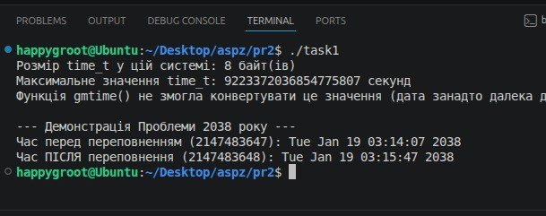

**Висновок:**
Тестування підтвердило, що на 64-бітній архітектурі ліміт часу практично відсутній, тоді як для застарілих систем "Проблема 2038 року" залишається критичною.

---

## Завдання 2.2: Аналіз сегментів виконуваного файлу

**Опис:**
Дослідження того, як глобальні змінні (ініціалізовані та ні) впливають на розміри сегментів Data та BSS.

**Пояснення:**
Ми порівнювали розміри файлу та його частин за допомогою утиліти `size`. Коли ми додаємо порожній масив, він потрапляє в BSS і не збільшує розмір файлу на диску. Коли ми додаємо масив з числами, він потрапляє в Data, і файл стає більшим.

**Результати команди size для різних варіантів масивів:**

Пункт 1: 

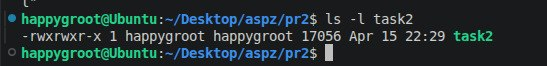
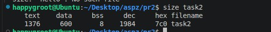

Пункт 2:

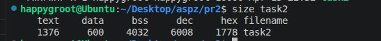

Пункт 3:

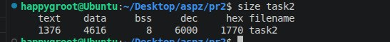

Пункт 4:

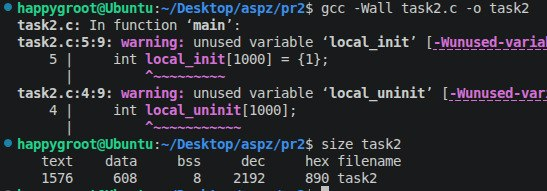

Пункт 5:

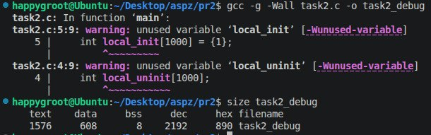

**Висновок:**
Сегмент BSS використовується для економії місця, оскільки зберігає лише інформацію про розмір неініціалізованих даних, тоді як ініціалізовані дані (Data) фізично записуються у файл.

---

## Завдання 2.3: Розташування стека та купи

**Опис:**
Визначення адрес пам'яті, за якими розташовуються код, глобальні змінні, динамічна пам'ять (купа) та стек.

**Пояснення:**
Програма виводить адреси різних змінних. Це дозволяє побачити "карту" пам'яті. Ми також перевірили, що при виклику нових функцій адреса стека зменшується, що вказує на напрямок його росту.

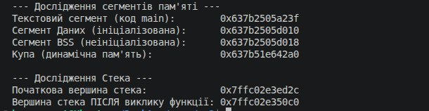

**Висновок:**
В ОС Linux на архітектурі x86_64 стек росте вниз (до менших адрес), а купа — вгору. Сегменти коду та даних розташовані значно нижче у віртуальному просторі.

---

## Завдання 2.4: Аналіз стека через GDB

**Опис:**
Використання налагоджувача для перегляду ланцюжка виклику функцій (backtrace) у процесі, що працює.

**Пояснення:**
Ми запустили програму, яка зупиняється на функції `pause()`, і підключилися до неї через GDB. Команда `bt` показала нам усі активні функції в стеку від `main` до поточної.

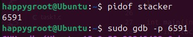
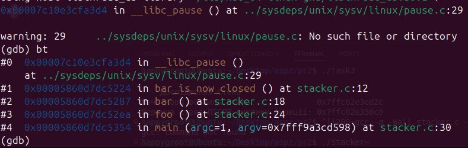

**Висновок:**
Налагоджувач дозволяє відстежити точний стан програми та послідовність викликів, що є ключовим для пошуку помилок у складних програмах.

---

## Завдання 2.5: Теоретичне обґрунтування IP та Стека

**Опис:**
Аналіз можливості заміни лічильника команд (IP) вершиною стека.

**Пояснення:**
Лічильник команд (Instruction Pointer) вказує на наступну дію, яку треба виконати прямо зараз. Стек зберігає лише дані та адреси повернення. Вони працюють разом, але один не може замінити іншого в класичній архітектурі.

**Висновок:**
Без IP процесор не знатиме, як рухатися по коду всередині однієї функції, тому використання лише стека для керування виконанням неможливе.

---

## Завдання 2_13: Вплив оптимізації -Os

**Опис:**
Порівняння розмірів сегментів програми при звичайній компіляції та компіляції з прапорцем `-Os` (оптимізація за розміром).

**Пояснення:**
Ми скомпілювали один і той самий код двічі. Оптимізація `-Os` змушує компілятор переписувати код так, щоб він займав якнайменше місця в пам'яті, не сильно втрачаючи у швидкості.

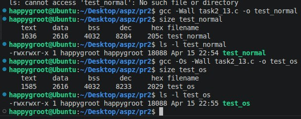

**Висновок:**
Використання `-Os` суттєво зменшує сегмент Text (код), при цьому сегменти Data та BSS залишаються без змін, оскільки вони залежать від оголошених даних, а не від логіки коду.
