# Практична робота №3: Дослідження обмежень ресурсів у середовищі Docker

## Завдання 3.1: Ліміти відкритих файлів у Docker

**Опис:**
Запуск Docker-контейнера та експерименти з максимальним лімітом ресурсів відкритих файлів (soft та hard ліміти).

**Пояснення:**
За допомогою команди `ulimit` ми перевірили та змінили обмеження на кількість файлових дескрипторів. З'ясували, що soft ліміт (`-S`) можна збільшувати до значення hard (`-H`), а перевищення жорсткого ліміту без прав суперкористувача неможливе.

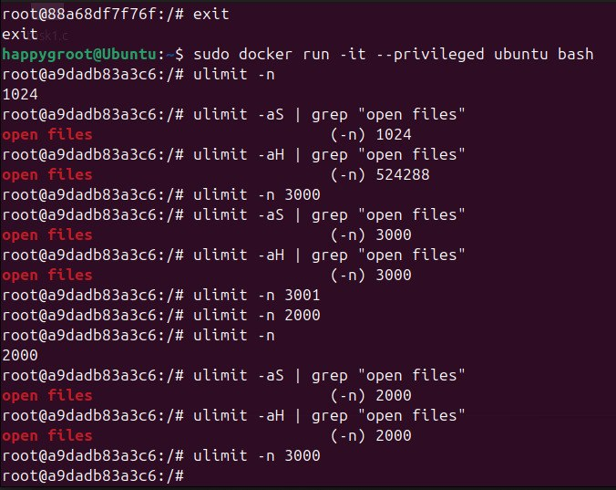

**Висновок:**
Утиліта `ulimit` дозволяє гнучко керувати ресурсами процесу. Встановлення правильних лімітів дескрипторів є критичним для високонавантажених серверів, щоб запобігти помилці "Too many open files".

---

## Завдання 3.2: Профілювання через perf та ліміти CPU

**Опис:**
Встановлення утиліти `perf` у Docker-контейнері та дослідження поведінки процесу при досягненні встановленого ліміту часу.

**Пояснення:**
За допомогою `perf stat` ми проаналізували використання ресурсів процесора тестовою програмою. Далі було встановлено жорсткий ліміт процесорного часу (`ulimit -t 2`). При його досягненні система примусово завершила процес.

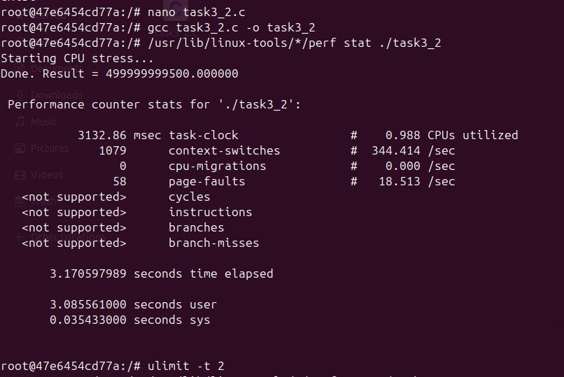
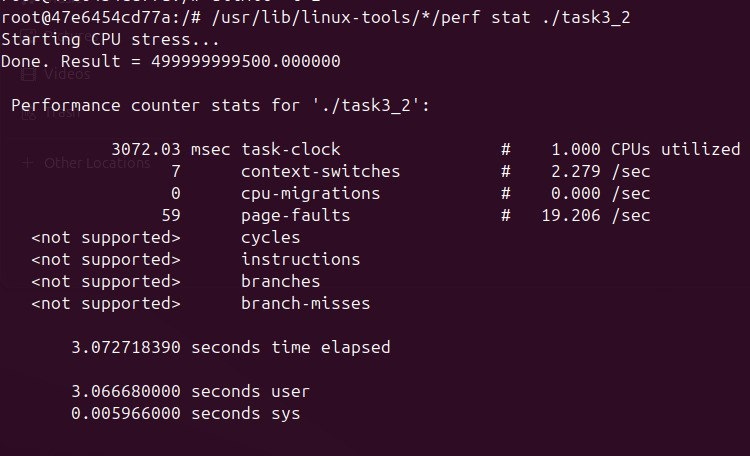

**Висновок:**
Обмеження CPU є ефективним інструментом для захисту системи від програм, що потрапили в нескінченний цикл або споживають забагато процесорного часу.

---

## Завдання 3.3: Обмеження розміру файлу (Імітація кубика)

**Опис:**
Створення програми, що імітує кидання кубика, записує результати у файл та коректно обробляє ситуацію перевищення ліміту на максимальний розмір файлу (max file size).

**Пояснення:**
Програма безперервно генерувала значення і писала їх у файл. Завдяки попередньо встановленому обмеженню розміру файлу на рівні ОС, процес отримав сигнал про перевищення і зупинив запис, вивівши відповідне повідомлення про помилку замість аварійного падіння.

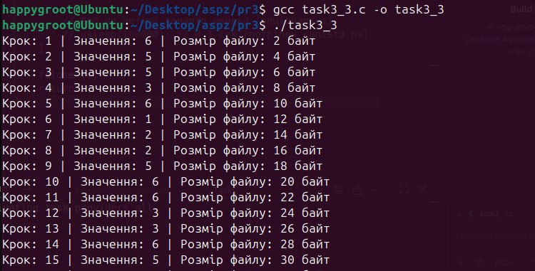
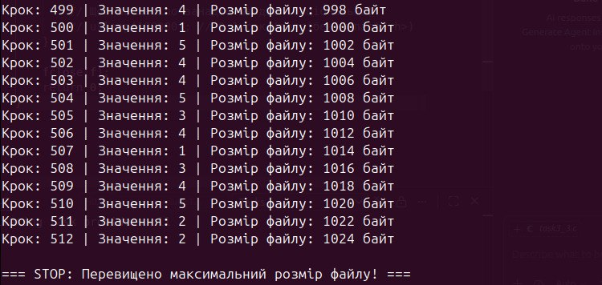

**Висновок:**
Механізм `ulimit -f` надійно захищає файлову систему від переповнення через неконтрольований запис (наприклад, лог-файлів), правильна обробка помилок дозволяє програмі завершитись безпечно.

---

## Завдання 3.4: Обмеження часу ЦП (Імітація лотереї)

**Опис:**
Написання програми для імітації лотереї ("7 із 49" та "6 із 36") із встановленим обмеженням max CPU time та генерацією результатів до вичерпання ліміту.

**Пояснення:**
Після встановлення ліміту `ulimit -t 2`, програма в безкінечному циклі генерувала комбінації лотереї. Як тільки процес вичерпав 2 секунди машинного часу, операційна система відправила сигнал `SIGKILL`, примусово завершивши програму з повідомленням "Killed".

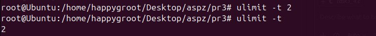
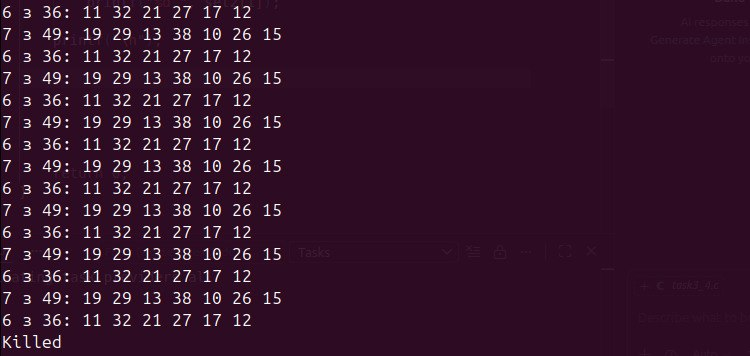

**Висновок:**
Система суворо контролює дотримання квот CPU, що не дозволяє одному процесу монополізувати всі обчислювальні потужності.

---

## Завдання 3.5: Копіювання з перевіркою обмежень

**Опис:**
Створення утиліти для копіювання іменованих файлів із перевіркою аргументів та обробкою ситуації перевищення обмеження на розмір файлу.

**Пояснення:**
Програма перевіряє передані аргументи та доступність файлів. Під час тестування з лімітом `ulimit -f 4` (обмеження розміру створеного файлу), копіювання було перервано операційною системою з помилкою "File size limit exceeded".

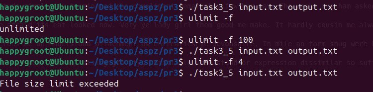

**Висновок:**
Програми, які працюють з файловими операціями, обов'язково повинні бути готовими до обмежень середовища, інакше операційна система перерве їх роботу на рівні ядра.

---

## Завдання 3.6: Обмеження розміру стека

**Опис:**
Написання програми, що демонструє використання обмеження максимального розміру стека (max stack segment size) за допомогою рекурсії.

**Пояснення:**
При сильному зменшенні ліміту стека (наприклад, до 4 КБ), запуск і навіть процес компіляції gcc починають поводитись нестабільно. Запуск програми зі зменшеним стеком швидко призводить до `Segmentation fault (core dumped)`, оскільки місця для збереження адрес повернення та локальних змінних не залишається.

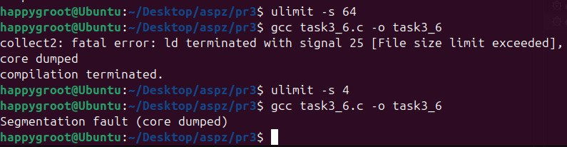

**Висновок:**
Для глибоких рекурсивних алгоритмів ліміт стека (`ulimit -s`) є ключовим параметром. Його перевищення завжди призводить до критичної помилки доступу до пам'яті.

---

## Завдання 3.7 (Варіант 13): Дослідження зміни обмежень ресурсів через /etc/security/limits.conf

**Опис:**
Дослідження зміни постійних обмежень ресурсів для конкретних користувачів за допомогою конфігураційного файлу `/etc/security/limits.conf` та перевірка впливу цих лімітів на виконання рекурсивної програми.

**Пояснення:**
На відміну від команди `ulimit`, яка працює лише в поточній сесії терміналу, файл `limits.conf` дозволяє задати перманентні правила. Було відредаговано цей файл та налаштувано специфічні ліміти стека. Перехід на створеного тестового користувача (`su testuser`) та перевірка застосування лімітів.

Запуск рекурсивної програми наочно продемонстрував, як розмір стека впливає на виконання:
- За одних умов (більший стек) програма досягала глибини рекурсії понад **7815** перед помилкою сегментації.
- Після обмеження стека для тестового користувача (`ulimit -s 8192`), пам'ять вичерпувалася значно швидше, і програма падала (Segmentation fault) вже на глибині **1901**.

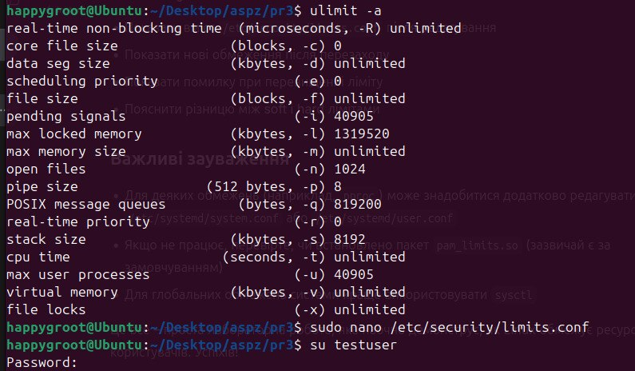
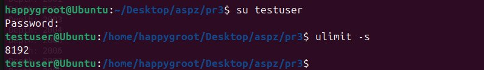
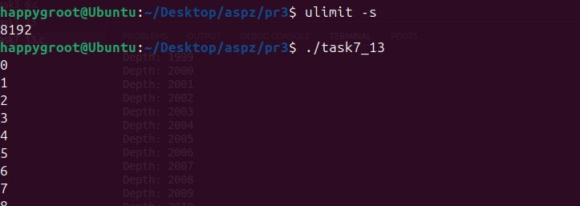
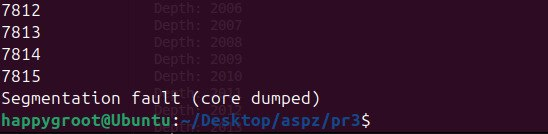
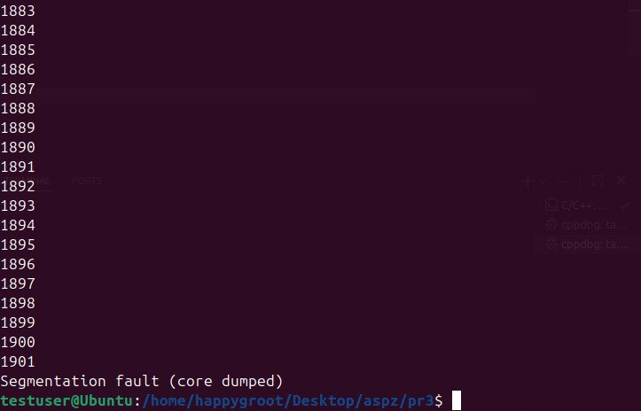

**Висновок:**
Редагування `/etc/security/limits.conf` є правильним та надійним способом адміністрування системи. Жорстко задані ліміти стека на рівні користувача прямо контролюють системні ресурси і запобігають їх надмірному споживанню окремими процесами.
