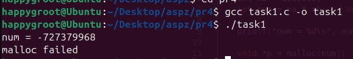
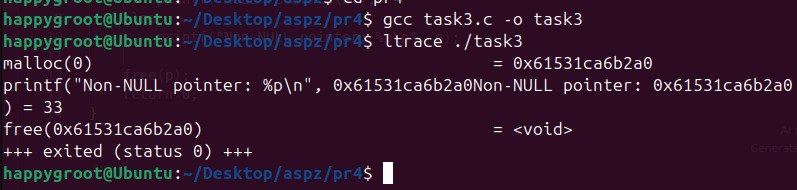
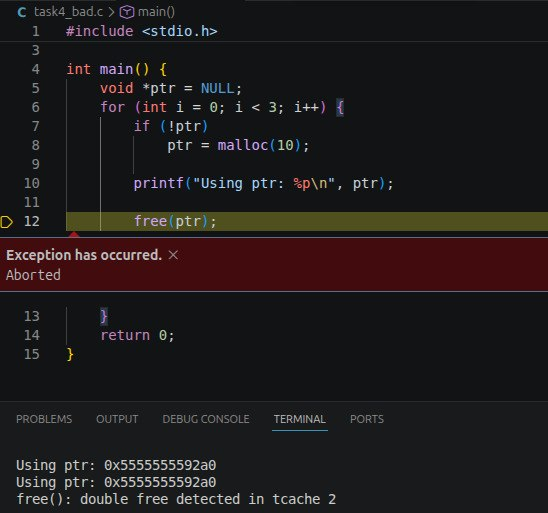
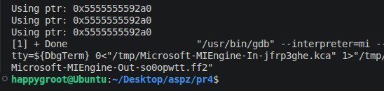
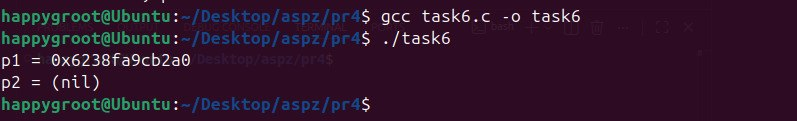
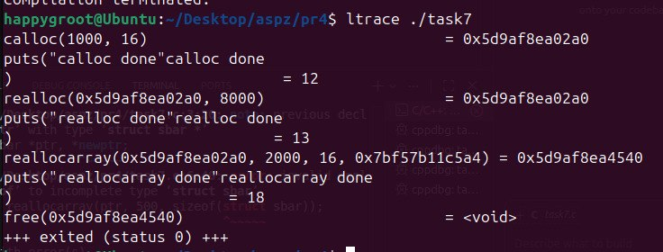
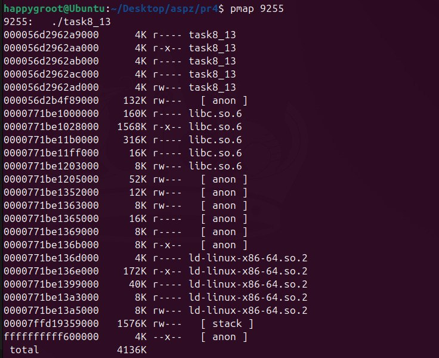
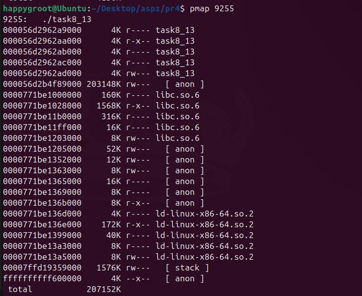
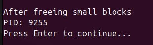
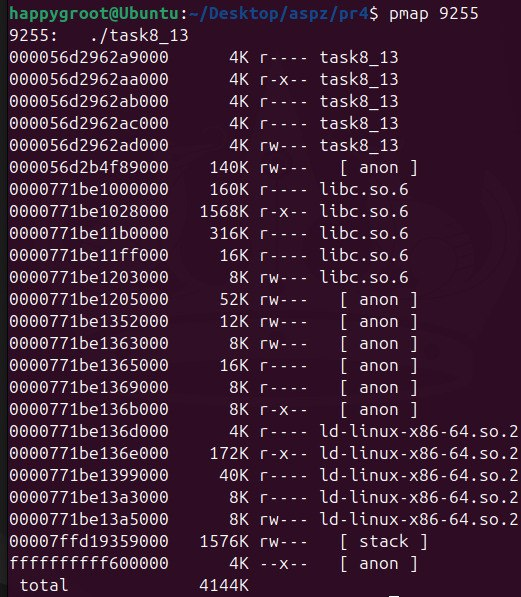

# Практична робота №4

## Завдання 4.1: Максимальний обсяг пам'яті для malloc(3)

**Опис:**
Дослідження теоретичних та практичних лімітів виділення пам'яті за один виклик `malloc(3)`.

**Пояснення:**
Параметр `malloc(3)` має тип `size_t`. На 64-бітній системі теоретично можна передати значення до 2^64−1 (~16 ексабайт). Проте на практиці максимальний розмір одного виділення обмежений приблизно 2^63−1 (~8 ексабайт). Це пов'язано з тим, що реалізації `malloc` (наприклад, у glibc) перевіряють розмір через знакові типи (як `ptrdiff_t`), щоб уникнути переповнення під час обчислення різниці вказівників. Оскільки `ptrdiff_t` — знаковий 64-бітний тип, його максимум якраз і складає 2^63−1. Додатково, реальні ліміти ще менші через обмеження віртуальної пам'яті процесора (зазвичай 128–256 ТБ).

**Висновок:**
Навіть на 64-бітних архітектурах неможливо виділити всі 16 ексабайт за один раз через архітектурні запобіжники та розмір знакових типів вказівників.

---

## Завдання 4.2: Від'ємні аргументи та переповнення

**Опис:**
Аналіз поведінки `malloc(3)` при передачі від'ємних значень або виникненні цілочисельного переповнення.

**Пояснення:**
Оскільки `malloc` приймає беззнаковий тип `size_t`, передача від'ємного значення призведе до його неявного перетворення у величезне додатне число. Якщо обчислювати розмір через знакову змінну `int` (`num = xa * xb`), то при переповненні результат може стати від'ємним або дуже малим. Передача від'ємного `num` в `malloc` призведе до запиту гігантського обсягу пам'яті (програма отримає `NULL`). Якщо ж через переповнення утвориться мале додатне число, виділиться замало пам'яті, що згодом викличе пошкодження даних при записі (buffer overflow).

**Висновок:**
На архітектурі x86 (32 біти) ці проблеми виникають частіше через менший діапазон типів, але наслідки (аварійне завершення або вразливість пам'яті) однаково критичні як на x86, так і на x86_64.

---

## Завдання 4.3: Виклик malloc(0)

**Опис:**
Дослідження результату виклику функції `malloc` з нульовим розміром за допомогою `ltrace`.

**Пояснення:**
Згідно зі стандартом, `malloc(0)` може повернути `NULL` або унікальний вказівник. У `glibc` зазвичай повертається валідний (ненульовий) вказівник. Його не можна розіменовувати для запису чи читання даних, але його можна (і треба) безпечно передати у `free()`. Аналіз через `ltrace` підтверджує, що функція викликається, повертає адресу, і пам'ять успішно звільняється без помилок.

**Висновок:**
Виклик `malloc(0)` не гарантує виділення корисного блоку пам'яті, але вимагає коректного звільнення, щоб уникнути попереджень аналізаторів пам'яті.

---

## Завдання 4.4: Помилка використання після звільнення (use-after-free)

**Опис:**
Пошук та виправлення логічної помилки в циклі з динамічною пам'яттю.

**Пояснення:**
У наданому коді після виконання `free(ptr)` вказівник не обнуляється. На наступній ітерації циклу перевірка `if (!ptr)` дає хибний результат (бо вказівник все ще містить стару адресу, хоч пам'ять вже не належить програмі). Відбувається запис у звільнену пам'ять (use-after-free), що є невизначеною поведінкою (UB) і призводить до крашу.
Для виправлення достатньо додати `ptr = NULL;` відразу після `free(ptr);`.

**Висновок:**
Завжди обнуляйте вказівники після їх звільнення (`free`), якщо вони можуть бути повторно перевірені або використані в потоці виконання.

---

## Завдання 4.5: Помилка виділення в realloc(3)

**Опис:**
Аналіз наслідків невдалого розширення пам'яті через `realloc`.

**Пояснення:**
Якщо `realloc` не може знайти безперервний блок потрібного розміру і не може розширити поточний, він повертає `NULL`. Важливий нюанс: старий блок пам'яті при цьому не звільняється і залишається валідним. Якщо в коді використана конструкція `ptr = realloc(ptr, new_size)`, то при невдачі старий вказівник буде перезаписаний `NULL`, і посилання на раніше виділену пам'ять зникне назавжди (витік пам'яті - memory leak).

**Висновок:**
Для `realloc` слід використовувати тимчасовий вказівник: `tmp = realloc(ptr, ...); if (tmp) ptr = tmp;`.

---

## Завдання 4.6: Граничні значення realloc(3)

**Опис:**
Перевірка поведінки функції `realloc` з аргументами `NULL` та нульовим розміром.

**Пояснення:**
- Виклик `realloc(NULL, size)` працює абсолютно ідентично до `malloc(size)`.
- Виклик `realloc(ptr, 0)` залежить від реалізації стандарту. У системних бібліотеках на кшталт `glibc` він поводиться як `free(ptr)` і повертає `NULL`, або ж працює як `malloc(0)`.

**Висновок:**
Функція `realloc` може замінити собою як `malloc`, так і `free`, залежно від переданих аргументів.

---

## Завдання 4.7: Використання reallocarray(3)

**Опис:**
Оптимізація коду розширення масивів та аналіз викликів через `ltrace`.

**Пояснення:**
Трасування програми показало: спочатку `calloc` виділив пам'ять під 1000 структур. Перший `realloc` зменшив обсяг вдвічі; оскільки перенесення даних не було потрібне, адреса в пам'яті не змінилася. Виклик `reallocarray` для збільшення масиву до 2000 елементів автоматично перевірив множення `2000 * sizeof(struct)` на переповнення і повернув нову адресу (системі довелося шукати новий великий блок та копіювати дані). Після всього викликано `free` за новою адресою.

**Висновок:**
Функція `reallocarray` є більш безпечною альтернативою `realloc` для масивів, оскільки самостійно обробляє можливі переповнення при обчисленні загального розміру.

---

## Завдання 4.13 (Варіант): Порівняння алокації великих та малих блоків

**Опис:**
Дослідження механізмів виділення пам'яті (`brk` проти `mmap`) через файл мапінгу пам'яті `/proc/self/maps`.

**Пояснення:**
При запиті на виділення великого блоку пам'яті (~200 МБ) `malloc` розуміє, що розширювати купу неефективно, і створює окремий анонімний сегмент пам'яті за допомогою системного виклику `mmap` (що чітко видно як окремий великий регіон у `maps`). 
При виділенні великої кількості малих блоків (200 000 по 1 КБ), `malloc` використовує стандартну купу (heap), розширюючи її за допомогою системного виклику `brk`. У `maps` це проявляється як поступове розростання єдиного сегменту `[heap]`.

**Висновок:**
Алокатор пам'яті `glibc` є адаптивним: для дрібних об'єктів він використовує класичну купу (`brk`) для швидкості, а для великих — відображення в пам'ять (`mmap`), щоб запобігти фрагментації та легко повертати великі обсяги системі.
