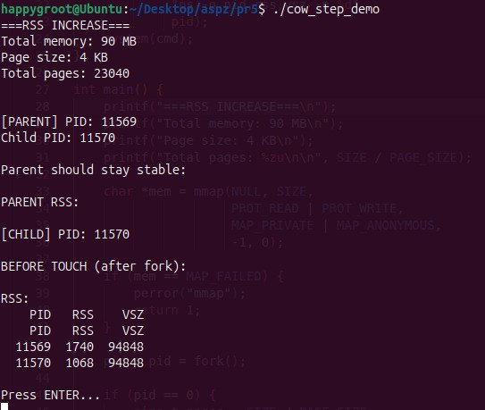
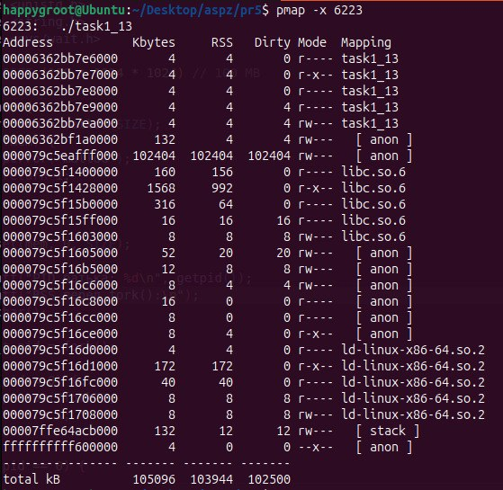

## Завдання 1.13: Аналіз поведінки RSS при Copy-On-Write (COW) з mmap + fork

**Опис:**
Дослідження зміни RSS (Resident Set Size) під час поетапного доступу до пам’яті, виділеної через `mmap`, у дочірньому процесі після `fork()`, з аналізом механізму Copy-On-Write (COW).

**Пояснення:**
Програма виділяє 90 МБ віртуальної пам’яті через `mmap`, після чого створюється дочірній процес за допомогою `fork()`. Одразу після `fork()` обидва процеси (батько і дитина) отримують однакові віртуальні адреси, які вказують на спільні фізичні сторінки пам’яті, позначені як read-only, тому RSS на цьому етапі не подвоюється і виглядає стабільним. Далі програма поетапно звертається до пам’яті через функцію `touch_range()`, яка навмисно записує по одному байту в кожну сторінку (крок 4 KB), що викликає page fault при першому записі в кожну сторінку. У цей момент ядро Linux застосовує механізм Copy-On-Write: воно копіює тільки ту сторінку (4 KB), до якої відбувся запис, створює її приватну копію для процесу, який виконав запис, і оновлює таблицю сторінок, після чого ця сторінка стає writable лише для нього. Через це RSS починає поступово рости не одразу, а поетапно (25%, 50%, 75%, 100%), бо кожен етап ініціалізує нові сторінки і змушує ОС фізично виділяти RAM тільки для реально змінених ділянок пам’яті. Таким чином програма “ламає” RSS у сенсі спостереження — спочатку пам’ять виглядає спільною, але після записів кожен процес починає накопичувати власні фізичні копії сторінок, і RSS збільшується пропорційно кількості реально змінених сторінок, а не загальному розміру виділеного блоку.

**Скріншоти:**

**Висновок:**
Copy-On-Write дозволяє `fork()` і `mmap` працювати ефективно: RSS зростає тільки при реальному записі в сторінки пам’яті, а не при їх виділенні, що дозволяє контролювати використання RAM і уникати повного копіювання 90 МБ одразу, перетворюючи його на поетапне створення фізичних копій сторінок лише при фактичній модифікації даних.
