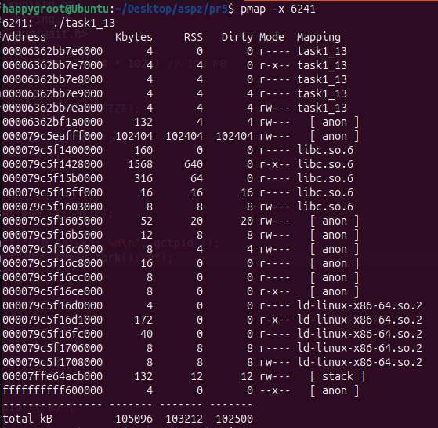
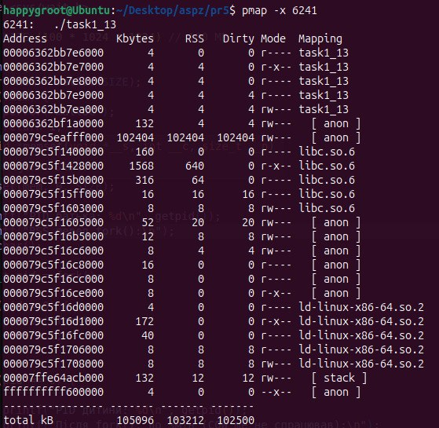

## Завдання 1.13: Аналіз механізму Copy-On-Write (COW) при використанні fork()

**Опис:**
Дослідження поведінки віртуальної та фізичної пам'яті під час створення дочірнього процесу через системний виклик `fork()` та аналіз відкладеного копіювання сторінок за допомогою утиліти `pmap`.

**Пояснення:**
Програма виділяє 100 МБ віртуальної пам'яті за допомогою `malloc` і примусово ініціалізує її нулями (`memset`). Це змушує операційну систему реально виділити фізичну пам'ять (ОЗП) під цей масив. Далі за допомогою `fork()` створюється дочірній процес, який паралельно продовжує виконання. 

Одразу після `fork()` операційна система не копіює всі 100 МБ даних для дочірнього процесу. Замість цього вона копіює лише таблиці сторінок. Віртуальна пам'ять обох процесів (батьківського та дочірнього) починає вказувати на один і той самий фізичний блок пам'яті, який позначається як Read-Only. Аналіз виводу `pmap -x <PID>` показує, що колонка RSS (Resident Set Size) становить ~100 МБ (`102404 Kbytes`) для обох процесів. Проте фактичне споживання оперативної пам'яті системою не подвоюється, оскільки пам'ять ділиться між ними на апаратному рівні.

Коли дочірній процес намагається змінити лише один байт у виділеному масиві (`mem[0] = 1`), відбувається спроба запису в Read-Only пам'ять. Процесор генерує виняток (Page Fault). Ядро Linux перехоплює його, копіює лише ту сторінку пам'яті (зазвичай розміром 4 КБ), до якої належить змінений байт, і оновлює таблицю сторінок дочірнього процесу. Це і є механізм Copy-On-Write (COW). Інші 99.99 МБ даних продовжують спільно використовуватися обома процесами.

**Висновок:**
Функція `fork()` працює надзвичайно ефективно і швидко завдяки механізму Copy-On-Write. Операційна система дублює фізичні сторінки пам'яті лише в момент їхньої фактичної зміни (запису), що дозволяє уникнути непотрібного копіювання великих обсягів даних, суттєво економить ресурси ОЗП та прискорює створення нових процесів.
