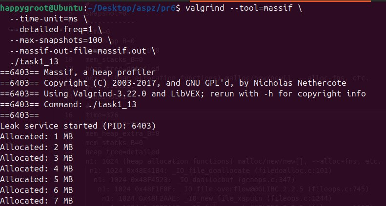
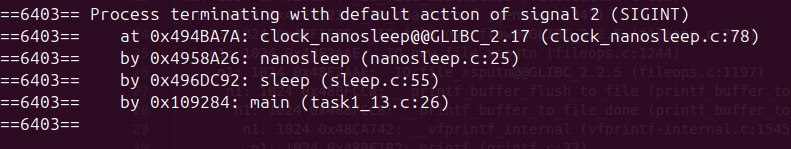

## Завдання 1.13: Профілювання витоків пам'яті (Memory Leaks) за допомогою Valgrind Massif

**Опис:**
Дослідження динаміки використання пам'яті на купі (heap) та виявлення штучно створеного витоку пам'яті за допомогою профайлера Valgrind Massif.

**Пояснення:**
Програма (`task1_13.c`) функціонує як сервіс, який у безкінечному циклі щосекунди виділяє 1 МБ пам'яті через функцію `malloc()` та ініціалізує її нулями за допомогою `memset()`. Оскільки звільнення пам'яті (`free()`) не передбачено, програма генерує безперервний витік пам'яті.

Для аналізу цього процесу використовується Valgrind — фреймворк для динамічного аналізу програм. Задіяний у ньому інструмент Massif виконує профілювання купи. Massif перехоплює всі виклики алокаторів пам'яті (таких як `malloc`) та періодично робить знімки (snapshots) поточного стану heap-пам'яті. Деталізовані знімки фіксують не лише загальний обсяг виділеної пам'яті (`mem_heap_B`), а й стек викликів (call stack). Це дозволяє відстежувати хронологію споживання ресурсів та точно ідентифікувати файл і рядок коду, які відповідають за виділення пам'яті.

**Код програми (`task1_13.c`):**
```c
#include <stdio.h>
#include <stdlib.h>
#include <unistd.h>
#include <string.h>

#define CHUNK_SIZE (1024 * 1024) // 1 MB

int main() {
    printf("Leak service started (PID: %d)\n", getpid());

    size_t total_allocated = 0;

    while (1) {
        void *ptr = malloc(CHUNK_SIZE);
        if (!ptr) {
            perror("malloc failed");
            break;
        }

        memset(ptr, 0, CHUNK_SIZE);

        total_allocated += CHUNK_SIZE;
        printf("Allocated: %zu MB\n", total_allocated / (1024 * 1024));

        sleep(1);
    }

    return 0;
}
```

**Вміст `massif.out`:**
```text
desc: --time-unit=ms --detailed-freq=1 --max-snapshots=100 --massif-out-file=massif.out
cmd: ./task1_13
time_unit: ms
#-----------
snapshot=0
#-----------
time=0
mem_heap_B=0
mem_heap_extra_B=0
mem_stacks_B=0
heap_tree=detailed
n0: 0 (heap allocation functions) malloc/new/new[], --alloc-fns, etc.
#-----------
snapshot=1
#-----------
time=376
mem_heap_B=1024
mem_heap_extra_B=8
mem_stacks_B=0
heap_tree=detailed
n1: 1024 (heap allocation functions) malloc/new/new[], --alloc-fns, etc.
 n1: 1024 0x48E41B4: _IO_file_doallocate (filedoalloc.c:101)
  n1: 1024 0x48F4523: _IO_doallocbuf (genops.c:347)
   n1: 1024 0x48F1F8F: _IO_file_overflow@@GLIBC_2.2.5 (fileops.c:745)
    n1: 1024 0x48F2AAE: _IO_new_file_xsputn (fileops.c:1244)
     n1: 1024 0x48F2AAE: _IO_file_xsputn@@GLIBC_2.2.5 (fileops.c:1197)
      n1: 1024 0x48BFCC8: __printf_buffer_flush_to_file (printf_buffer_to_file.c:59)
       n1: 1024 0x48BFCC8: __printf_buffer_to_file_done (printf_buffer_to_file.c:120)
        n1: 1024 0x48CA742: __vfprintf_internal (vfprintf-internal.c:1545)
         n1: 1024 0x48BF1B2: printf (printf.c:33)
          n0: 1024 0x10920F: main (task1_13.c:10)
#-----------
snapshot=2
#-----------
time=379
mem_heap_B=1049600
mem_heap_extra_B=16
mem_stacks_B=0
heap_tree=detailed
n2: 1049600 (heap allocation functions) malloc/new/new[], --alloc-fns, etc.
 n0: 1048576 0x109221: main (task1_13.c:15)
 n0: 1024 in 1 place, below massif's threshold (1.00%)
#-----------
snapshot=3
#-----------
time=1858
mem_heap_B=2098176
mem_heap_extra_B=24
mem_stacks_B=0
heap_tree=detailed
n2: 2098176 (heap allocation functions) malloc/new/new[], --alloc-fns, etc.
 n0: 2097152 0x109221: main (task1_13.c:15)
 n0: 1024 in 1 place, below massif's threshold (1.00%)
#-----------
snapshot=4
#-----------
time=2860
mem_heap_B=3146752
mem_heap_extra_B=32
mem_stacks_B=0
heap_tree=detailed
n2: 3146752 (heap allocation functions) malloc/new/new[], --alloc-fns, etc.
 n0: 3145728 0x109221: main (task1_13.c:15)
 n0: 1024 in 1 place, below massif's threshold (1.00%)
#-----------
snapshot=5
#-----------
time=3867
mem_heap_B=4195328
mem_heap_extra_B=40
mem_stacks_B=0
heap_tree=detailed
n2: 4195328 (heap allocation functions) malloc/new/new[], --alloc-fns, etc.
 n0: 4194304 0x109221: main (task1_13.c:15)
 n0: 1024 in 1 place, below massif's threshold (1.00%)
#-----------
snapshot=6
#-----------
time=4877
mem_heap_B=5243904
mem_heap_extra_B=48
mem_stacks_B=0
heap_tree=detailed
n2: 5243904 (heap allocation functions) malloc/new/new[], --alloc-fns, etc.
 n0: 5242880 0x109221: main (task1_13.c:15)
 n0: 1024 in 1 place, below massif's threshold (1.00%)
#-----------
snapshot=7
#-----------
time=5881
mem_heap_B=6292480
mem_heap_extra_B=56
mem_stacks_B=0
heap_tree=detailed
n2: 6292480 (heap allocation functions) malloc/new/new[], --alloc-fns, etc.
 n0: 6291456 0x109221: main (task1_13.c:15)
 n0: 1024 in 1 place, below massif's threshold (1.00%)
#-----------
snapshot=8
#-----------
time=6884
mem_heap_B=7341056
mem_heap_extra_B=64
mem_stacks_B=0
heap_tree=detailed
n2: 7341056 (heap allocation functions) malloc/new/new[], --alloc-fns, etc.
 n0: 7340032 0x109221: main (task1_13.c:15)
 n0: 1024 in 1 place, below massif's threshold (1.00%)
#-----------
snapshot=9
#-----------
time=7890
mem_heap_B=8389632
mem_heap_extra_B=72
mem_stacks_B=0
heap_tree=detailed
n2: 8389632 (heap allocation functions) malloc/new/new[], --alloc-fns, etc.
 n0: 8388608 0x109221: main (task1_13.c:15)
 n0: 1024 in 1 place, below massif's threshold (1.00%)
#-----------
snapshot=10
#-----------
time=8896
mem_heap_B=9438208
mem_heap_extra_B=80
mem_stacks_B=0
heap_tree=detailed
n2: 9438208 (heap allocation functions) malloc/new/new[], --alloc-fns, etc.
 n0: 9437184 0x109221: main (task1_13.c:15)
 n0: 1024 in 1 place, below massif's threshold (1.00%)
#-----------
snapshot=11
#-----------
time=10055
mem_heap_B=10486784
mem_heap_extra_B=88
mem_stacks_B=0
heap_tree=detailed
n2: 10486784 (heap allocation functions) malloc/new/new[], --alloc-fns, etc.
 n0: 10485760 0x109221: main (task1_13.c:15)
 n0: 1024 in 1 place, below massif's threshold (1.00%)
#-----------
snapshot=12
#-----------
time=11057
mem_heap_B=11535360
mem_heap_extra_B=96
mem_stacks_B=0
heap_tree=detailed
n2: 11535360 (heap allocation functions) malloc/new/new[], --alloc-fns, etc.
 n0: 11534336 0x109221: main (task1_13.c:15)
 n0: 1024 in 1 place, below massif's threshold (1.00%)
#-----------
snapshot=13
#-----------
time=12059
mem_heap_B=12583936
mem_heap_extra_B=104
mem_stacks_B=0
heap_tree=detailed
n2: 12583936 (heap allocation functions) malloc/new/new[], --alloc-fns, etc.
 n0: 12582912 0x109221: main (task1_13.c:15)
 n0: 1024 in 1 place, below massif's threshold (1.00%)
#-----------
snapshot=14
#-----------
time=13061
mem_heap_B=13632512
mem_heap_extra_B=112
mem_stacks_B=0
heap_tree=detailed
n2: 13632512 (heap allocation functions) malloc/new/new[], --alloc-fns, etc.
 n0: 13631488 0x109221: main (task1_13.c:15)
 n0: 1024 in 1 place, below massif's threshold (1.00%)
#-----------
```

**Скріншоти:**




**Висновок:**
Аналіз логів `massif.out` наочно підтверджує наявність неконтрольованого витоку пам'яті. Спостерігається стабільне лінійне зростання параметра `mem_heap_B`: від ~1 МБ на знімку (time=379 ms) до ~13 МБ  (time=13061 ms). Деталізоване дерево викликів вказує на те, що практично 100% цих виділень походять із функції `main` (файл `task1_13.c`, рядок 15). Використання Valgrind Massif дозволило точно локалізувати проблемну ділянку коду, яка ініціює алокацію без подальшого звільнення ресурсу, та простежити динаміку деградації доступної пам'яті в часі.
