## Практична робота 7: Дослідження, моделювання та нестандартні підходи до аналізу процесів, файлових систем, безпеки та ресурсів в Linux

Системне програмування в Linux охоплює розробку програм, які взаємодіють безпосередньо з ядром операційної системи, апаратними ресурсами та низькорівневими сервісами. Цей підхід вимагає глибокого розуміння механізмів ядра, системних викликів, файлових дескрипторів та прав доступу.

---

## Завдання 1: Передача виводу через `popen()`

**Опис:**
Використання `popen()`, щоб передати вивід команди `rwho` до `more` у програмі на C.

**Пояснення:**
Програма створює два канали зв'язку за допомогою функції `popen()`. Перший виклик відкриває процес `who` (оскільки `rwho` може бути недоступним у всіх системах за замовчуванням) у режимі читання (`"r"`). Другий виклик відкриває утиліту `more` у режимі запису (`"w"`). У циклі `while` дані порядково зчитуються з першого потоку у буфер за допомогою `fgets` і одразу записуються у другий потік через `fputs`. Після завершення передачі обидва потоки коректно закриваються через `pclose()`.

**Скріншоти:**

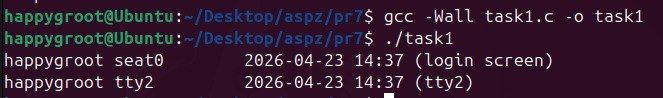

**Висновок:**
Продемонстровано створення каналів міжпроцесної взаємодії (pipes) та перенаправлення стандартних потоків вводу/виводу системних утиліт зсередини C-програми.

---

## Завдання 2: Імітація команди `ls -l`

**Опис:**
Написання програми, яка імітує команду `ls -l` в UNIX — виводить список усіх файлів у поточному каталозі та перелічує права доступу, власників, розмір та час модифікації.

**Пояснення:**
Для обходу каталогу використовуються функції `opendir()` та `readdir()`. Для кожного знайденого елемента викликається `stat()`, щоб отримати структуру з метаданими файлу. Права доступу формуються в окремій функції `print_permissions()` за допомогою побітових операцій з полем `st_mode` (наприклад, `mode & S_IRUSR`). Імена власника та групи отримуються шляхом перетворення UID та GID через функції `getpwuid()` та `getgrgid()`. Форматування часу модифікації (`st_mtime`) реалізовано через `localtime()` та `strftime()`.

**Скріншоти:**

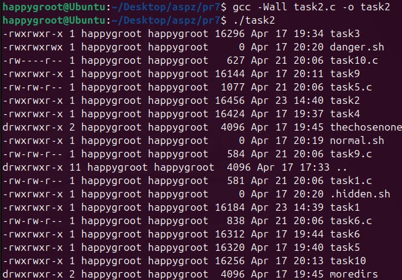

**Висновок:**
Засвоєно роботу зі структурою `stat`, конвертацію ідентифікаторів користувачів/груп у рядкові імена та маніпуляції з бітовими масками дозволів файлової системи POSIX.

---

## Завдання 3: Спрощена версія утиліти `grep`

**Опис:**
Написання програми, яка друкує рядки з файлу, що містять слово, передане як аргумент програми.

**Пояснення:**
Програма приймає цільове слово та шлях до файлу через аргументи `argc` та `argv`. Файл відкривається у режимі читання. За допомогою `fgets()` програма зчитує файл порядково у буфер розміром 2048 байт. Для перевірки наявності шуканого слова у рядку використовується стандартна функція `strstr()`. Якщо функція повертає вказівник (слово знайдено), рядок виводиться на екран.

**Скріншоти:**

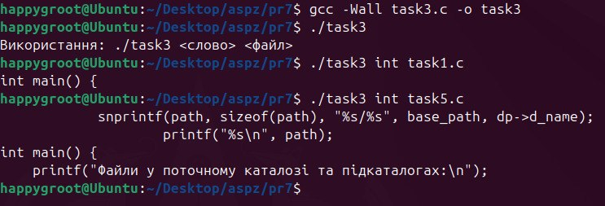

**Висновок:**
Реалізовано ефективний порядковий парсинг текстових файлів та пошук підрядків без завантаження всього файлу в оперативну пам'ять.

---

## Завдання 4: Спрощена версія утиліти `more`

**Опис:**
Програма, яка виводить список файлів, заданих у вигляді аргументів, з зупинкою кожні 20 рядків, доки не буде натиснута клавіша.

**Пояснення:**
Головною особливістю реалізації є відкриття пристрою `/dev/tty` для читання символів. Це необхідно для того, щоб програма могла коректно реагувати на натискання `Enter` навіть тоді, коли її власний `stdin` може бути перенаправлений. Лічильник `line_count` відстежує кількість виведених рядків. Як тільки він досягає 20, програма призупиняється та очікує вводу через `fgetc(tty)`, після чого лічильник скидається.

**Скріншоти:**

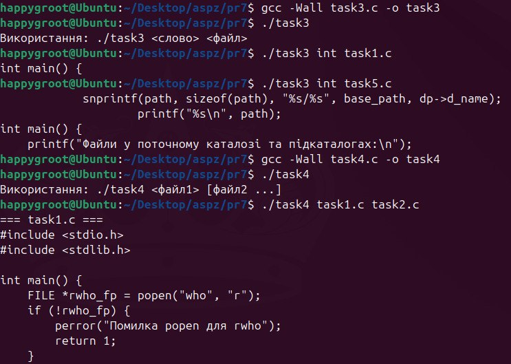
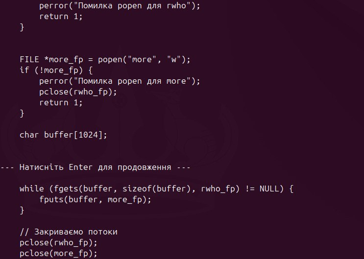

**Висновок:**
Розглянуто специфіку роботи з термінальними пристроями (`/dev/tty`) для забезпечення інтерактивності консольних додатків під час обробки потоків даних.

---

## Завдання 5: Рекурсивний обхід каталогів

**Опис:**
Написання програми, яка перелічує всі файли в поточному каталозі та всі файли в підкаталогах.

**Пояснення:**
Реалізовано функцію `list_files_recursively()`. Під час перебору директорії програма ігнорує поточний `.` та батьківський `..` каталоги, щоб уникнути нескінченного циклу. Для кожного елемента формується повний шлях за допомогою `snprintf()`. Якщо `stat()` вказує, що знайдений елемент є директорією (`S_ISDIR`), функція викликає саму себе рекурсивно, передаючи новий шлях. В іншому випадку — просто друкує шлях до файлу.

**Скріншоти:**

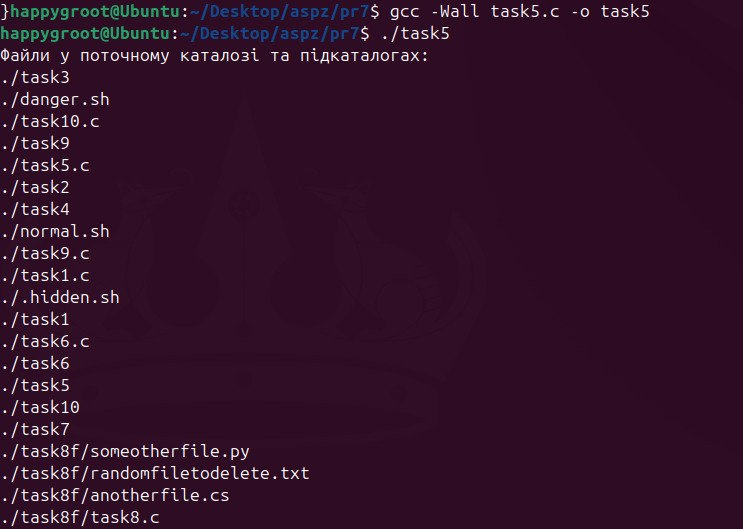

**Висновок:**
Продемонстровано побудову дерева файлової системи за допомогою рекурсивних алгоритмів та системних викликів роботи з каталогами.

---

## Завдання 6: Виведення підкаталогів за алфавітом

**Опис:**
Програма, яка перелічує лише підкаталоги у алфавітному порядку.

**Пояснення:**
Замість ручного перебору та сортування, використано функцію `scandir()`. Вона автоматично сканує каталог, виділяє пам'ять для масиву структур `dirent` і сортує їх за допомогою вбудованого компаратора `alphasort`. Для фільтрації передається власна функція `filter_only_dirs()`, яка перевіряє метадані елемента через `stat()` і повертає не-нуль лише для директорій (відкидаючи `.` та `..`).

**Скріншоти:**

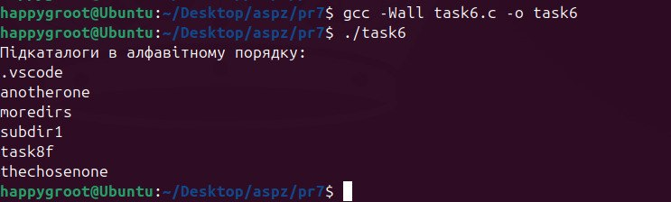

**Висновок:**
Ефективно застосовано високорівневі POSIX-функції для гнучкої фільтрації та сортування вмісту директорій.

---

## Завдання 7: Інтерактивне керування правами доступу (chmod)

**Опис:**
Програма, яка показує користувачу вихідні програми на C, а потім в інтерактивному режимі запитує, чи потрібно надати іншим дозвіл на читання; у разі ствердної відповіді — такий дозвіл надається.

**Пояснення:**
Під час сканування поточного каталогу програма фільтрує файли за допомогою `strrchr()`, шукаючи розширення `.c`. Для регулярних файлів виводиться інтерактивний запит. Якщо користувач вводить 'y' або 'Y', поточні права доступу зчитуються зі структури `stat`, до них застосовується побітове АБО з константою `S_IROTH`, після чого оновлені права застосовуються системним викликом `chmod()`.

**Скріншоти:**

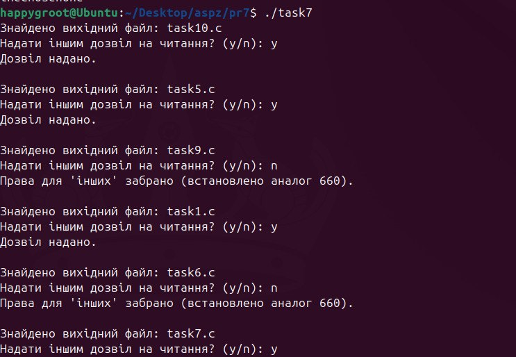
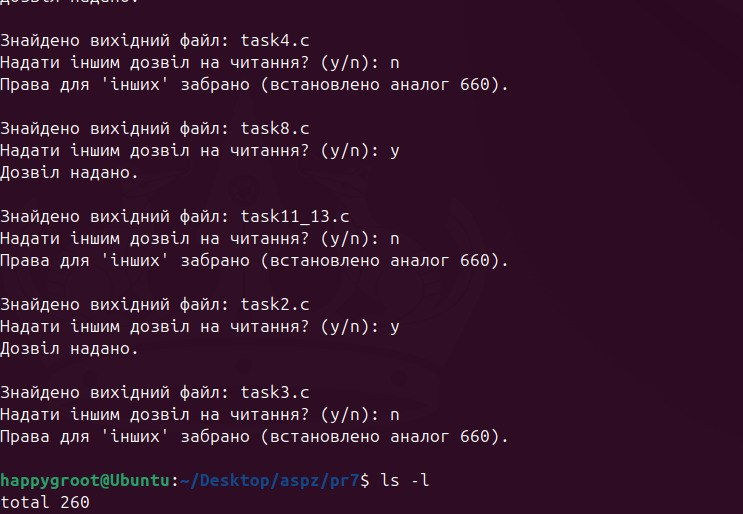
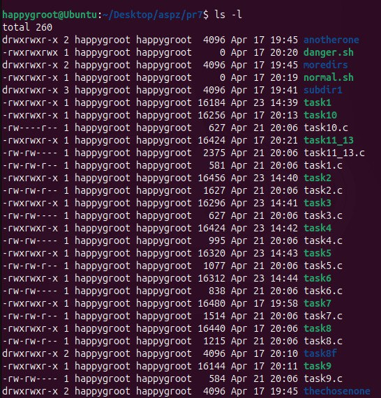

**Висновок:**
Реалізовано безпечну модифікацію прав доступу до файлів під час виконання програми.

---

## Завдання 8: Інтерактивне видалення файлів

**Опис:**
Написання програми, яка надає можливість видалити будь-який або всі файли у поточному робочому каталозі із запитом на підтвердження.

**Пояснення:**
Логіка обходу каталогу аналогічна до попередніх завдань. Для кожного знайденого регулярного файлу (`S_ISREG`) виводиться запит на видалення. У разі підтвердження програма викликає `unlink()`.

**Скріншоти:**

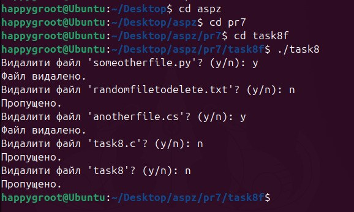

**Висновок:**
Засвоєно використання `unlink()` для програмного видалення файлів з перевіркою намірів користувача.

---

## Завдання 9: Вимірювання часу виконання у мілісекундах

**Опис:**
Програма на C, яка вимірює час виконання фрагмента коду в мілісекундах.

**Пояснення:**
Використовується `gettimeofday()`. Фіксується час до (`start`) та після (`end`) виконання. Час обчислюється як різниця.

**Скріншоти:**

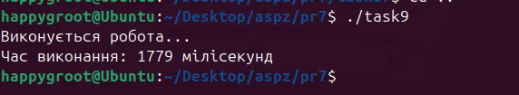

**Висновок:**
Реалізовано високоточне профілювання коду.

---

## Завдання 10: Генератор випадкових чисел з плаваючою комою

**Опис:**
Програма для створення випадкових чисел у діапазонах `[0.0, 1.0]` та `[0.0, n]`.

**Пояснення:**
Використовується `rand()` та `srand(time(NULL) ^ getpid())`. Нормалізація через `RAND_MAX`.

**Скріншоти:**

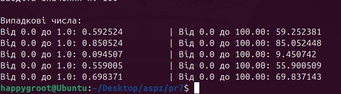

**Висновок:**
Реалізовано генерацію псевдовипадкових чисел.

---

## Завдання 11.13: Виявлення "аномальних" виконуваних файлів

**Опис:**
Розробка утиліти командного рядка для рекурсивного сканування директорій та виявлення потенційно небезпечних виконуваних файлів на основі їхніх прав доступу.

**Пояснення:**
Програма працює у два етапи. Спочатку функція `scan_directory` рекурсивно обходить каталог (використовуючи `opendir` та `readdir`), відсіюючи системні посилання `.` та `..`. Якщо знайдено файл, його метадані зчитуються через `lstat` і передаються у `check_for_anomaly`. 

Далі перевіряється, чи є файл регулярним і чи має він біт виконання (`S_IXUSR`, `S_IXGRP` або `S_IXOTH`). Якщо файл виконуваний, він аналізується на наявність чотирьох аномалій за допомогою побітових масок:
1. `S_ISUID` (SUID) — запуск із правами власника файлу.
2. `S_ISGID` (SGID) — запуск із правами групи.
3. `S_IWOTH` — доступність для запису будь-якому користувачеві (World-Writable).
4. Перевірка першого символу імені на `.` (щоб виявити приховані виконувані файли).
Якщо хоча б одна умова виконується, формується рядок з причиною і виводиться попередження.

**Скріншоти:**

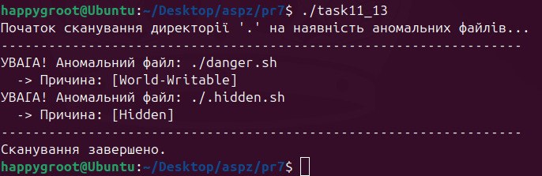

**Висновок:**
Створено інструмент аудиту безпеки файлової системи, який автоматизує пошук вразливих конфігурацій доступу до виконуваних файлів.
