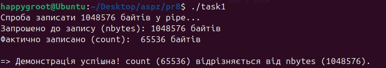
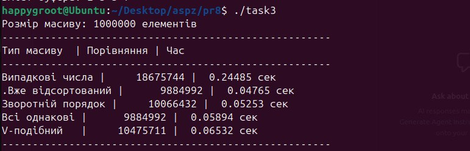

## Практична робота 8: Системні виклики в UNIX/POSIX та процесоутворення

Системне програмування в UNIX/POSIX вимагає глибокого розуміння того, як операційна система керує файловими операціями, пам'яттю та процесами. У цій роботі досліджуються особливості системних викликів вводу/виводу, поведінка алгоритмів сортування за різних умов, а також створення дочірніх процесів та конкурентний доступ до спільних ресурсів.

---

## Завдання 8.1: Дослідження часткового запису `write()`

**Опис:**
Аналіз ситуацій, коли системний виклик `write()` записує менше байтів, ніж було запрошено (коли повернуте значення `count` менше за `nbytes`).

**Пояснення:**
Інпутом є масив даних (буфер) та кількість байтів для запису (`nbytes`). Виклик `write()` дійсно може повернути значення, відмінне від `nbytes`. Головними причинами є:
1. Переривання системного виклику обробником сигналу до того, як всі дані були записані.
2. Нестача вільного місця на диску (фізичний ліміт).
3. Досягнення ліміту дискової квоти користувача.
4. Запис у канали (pipes) або сокети, де внутрішній буфер ядра має менший розмір, ніж обсяг переданих даних.
У написаній програмі продемонстровано, що для гарантованого запису всіх даних необхідно використовувати цикл, який продовжує викликати `write()`, поки не запише весь залишок буфера.

**Скріншоти:**

**Висновок:**
Доведено важливість обробки часткових записів та помилок для забезпечення цілісності даних при низькорівневому системному програмуванні.

---

## Завдання 8.2: Позиціонування у файлі через `lseek()`

**Опис:**
Робота з вказівником позиції у файлі та зчитування визначеної кількості байтів за допомогою комбінації `lseek()` та `read()`.

**Пояснення:**
Інпутом є відкритий файл, що містить таку послідовність байтів: `4, 5, 2, 2, 3, 3, 7, 9, 1, 5`. 
Системний виклик `lseek(fd, 3, SEEK_SET)` переміщує файловий вказівник на абсолютне зміщення `3`. Оскільки індексація зміщень у файлі починається з нуля (0-й байт — це `4`, 1-й — `5`, 2-й — `2`), вказівник опиниться на 4-му за рахунком байті, значення якого дорівнює `2`.
Наступний виклик `read(fd, &buffer, 4)` зчитує рівно 4 байти, починаючи з цієї позиції. Відповідно, у буфер копіюються байти за індексами 3, 4, 5 та 6. Після завершення виклику буфер містить масив: `2, 3, 3, 7`.

**Скріншоти:**

**Висновок:**
Засвоєно механізм довільного доступу до даних у файлі (Random Access) та специфіку нульової індексації зміщень файлового дескриптора в POSIX.

---

## Завдання 8.3: Аналіз та тестування функції `qsort()`

**Опис:**
Дослідження поведінки та деградації продуктивності бібліотечної функції `qsort()` на специфічних наборах вхідних даних, а також розробка тестів для перевірки її правильності.

**Пояснення:**
Для виявлення найгіршого випадку (коли складність падає до $O(n^2)$) програма автоматично генерує різні масиви даних: випадкові, вже відсортовані, відсортовані у зворотному порядку, а також масиви з однакових елементів. Найгіршим сценарієм для стандартної реалізації QuickSort є відсортовані масиви або масиви з ідентичними даними, оскільки відбувається невдалий вибір опорного елемента (pivot). Програма фіксує та порівнює час виконання на цих масивах. 
Окремо реалізовано набір тестів з використанням `assert()`, який автоматично перевіряє правильність сортування різних типів даних після відпрацювання користувацької функції порівняння.

**Скріншоти:**

**Висновок:**
Продемонстровано вразливості алгоритму швидкого сортування до певних патернів вхідних даних та засвоєно підходи до модульного тестування алгоритмів у C.

---

## Завдання 8.4: Аналіз результату виклику `fork()`

**Опис:**
Прогнозування та перевірка виводу програми, що створює точну копію поточного процесу (дочірній процес).

**Пояснення:**
Програма містить системний виклик `fork()` з подальшим виведенням змінної `pid` через `printf`. Особливість `fork()` полягає в тому, що він викликається один раз, але повертає значення двічі:
* У **батьківському процесі** повертається ідентифікатор створеного дочірнього процесу (PID > 0).
* У **дочірньому процесі** повертається `0`.
Оскільки обидва процеси незалежно продовжують виконання з наступного рядка коду, функція `printf` виконується двічі. В результаті програма виведе **два рядки**: один із позитивним числом (PID нащадка), а інший — `0`. Порядок їх появи не гарантований і залежить від планувальника завдань ядра Linux.

**Скріншоти:**

**Висновок:**
Досліджено семантику створення процесів у UNIX, розгалуження потоку виконання та специфіку повернених значень системного виклику `fork()`.

---

## Завдання 8.5.13: Конкурентний запис у спільний файл (`mmap` vs `write`)

**Опис:**
Побудова системи, яка перезаписує файл розміром 3 МБ з одночасним використанням відображення в пам'ять `mmap()` та системного виклику `write()`.

**Пояснення:**
Батьківський процес масово записує символи `W` через єдиний виклик `write()`, передаючи весь 3 МБ буфер. Дочірній процес паралельно проходить по файлу побайтово у циклі, записуючи символи `M` через пам'ять, відображену за допомогою `mmap()`, з подальшою синхронізацією `msync()`.
Головна особливість експерименту — швидкодія. Єдиний системний виклик `write()` виконується значно швидше, тоді як повільніший побайтовий цикл через `mmap` встигає "перезаписати" більшу частину даних після завершення `write()`. Підрахунок символів за допомогою утиліти `grep` підтверджує це: символів `M` у файлі виявилося приблизно в 9 разів більше. Крім того, через те що Linux блокує сторінки пам'яті (lock) та оптимізує запис шматками, рівномірного перемішування (на кшталт `MWMWMW`) не відбувається — символи записуються суцільними послідовними блоками (`MMMMMWWWMMM`).

**Скріншоти:**

**Висновок:**
Експериментально досліджено виникнення стану гонитви (race condition) при конкурентному доступі до файлу. Показано кардинальну різницю у швидкості виконання між масовим дисковим записом та побайтовим доступом до оперативної пам'яті.
