## Практична робота 9: Керування обліковими записами, правами доступу та системними файлами в Linux

Дана практична робота присвячена дослідженню механізмів авторизації, управління правами доступу (UID/GID) та взаємодії з системними директоріями і файлами. Використовуються Bash-скрипти для автоматизації перевірок, імітації підвищення привілеїв та аудиту безпеки.

---

## Завдання 9.1: Пошук звичайних користувачів системи

**Опис:**
Скрипт для читання бази облікових записів та ідентифікації інших звичайних користувачів.

**Пояснення:**
Входом для скрипта є системна база даних `passwd`, до якої він звертається через команду `getent passwd`. Скрипт парсить кожен рядок, використовуючи двокрапку (`:`) як розділювач полів. Відбувається перевірка ідентифікатора користувача (UID): якщо `uid` більший або дорівнює встановленому мінімуму (`MIN_UID=1000`) і ім'я не збігається з поточним користувачем, скрипт виводить його на екран. Це дозволяє програмно фільтрувати системні сервісні акаунти від реальних користувачів.

**Скріншоти:**

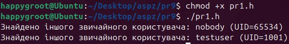

**Висновок:**
Продемонстровано роботу з системними даними та парсинг текстових баз за допомогою вбудованих інструментів Bash для інвентаризації користувачів.

---

## Завдання 9.2: Читання захищених системних файлів

**Опис:**
Виконання команди для читання хешів паролів (`/etc/shadow`) від імені адміністратора.

**Пояснення:**
Скрипт складається з однієї команди: `sudo cat /etc/shadow`. Входом є спроба доступу до файлу, який містить критичні дані і недоступний звичайним користувачам для читання. Особливістю є використання `sudo`, яке тимчасово підвищує привілеї користувача до `root` (якщо це дозволено конфігурацією `/etc/sudoers`), дозволяючи успішно виконати операцію та вивести вміст файлу.

**Скріншоти:**

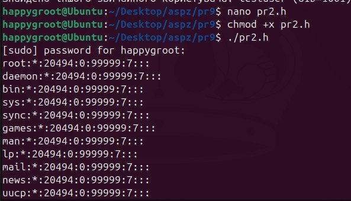

**Висновок:**
Засвоєно механізм ескалації привілеїв через `sudo` для доступу до захищених ресурсів.

---

## Завдання 9.3: Парадокси дозволів на модифікацію та видалення

**Опис:**
Дослідження відмінностей між дозволами на файл та дозволами на директорію при спробі модифікації та видалення файлу, що належить `root`.

**Пояснення:**
Скрипт створює текстовий файл як звичайний користувач. Потім, використовуючи `sudo cp`, копіює його, через що власником копії стає `root`. При спробі модифікувати цей файл (дописати текст) звичайним користувачем, система відмовляє у доступі, оскільки відсутні права на запис до самого файлу. Однак, при спробі видалити цей же файл командою `rm`, операція завершується успішно. Це відбувається тому, що видалення файлу є операцією над *директорією* (зміною її вмісту), а користувач має повні права на запис у свій домашній каталог.

**Скріншоти:**

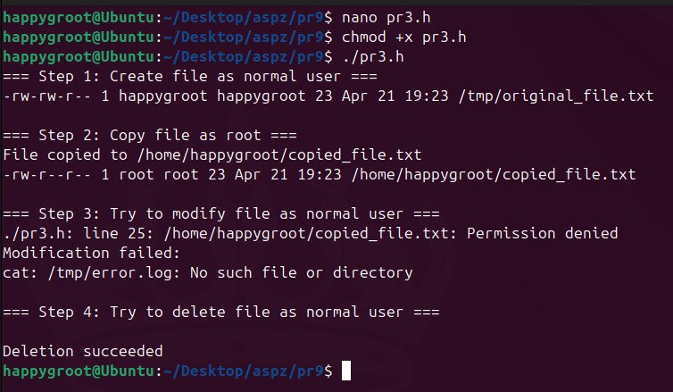

**Висновок:**
Практично доведено, що для редагування потрібні права на сам файл, а для його видалення — права на запис у батьківську директорію, незалежно від власника самого файлу.

---

## Завдання 9.4: Перевірка стану облікового запису та груп

**Опис:**
Отримання повної інформації про поточного користувача, його UID, GID та список груп.

**Пояснення:**
Скрипт використовує системні утиліти `whoami` та `id`. Команда `id` виводить вичерпну інформацію, а її параметри (`-u`, `-g`, `-Gn`) дозволяють ізолювати конкретні ідентифікатори. За допомогою циклу `for` скрипт ітерується по списку груп, до яких входить користувач, і виводить їх у читабельному форматі. Входом є поточний контекст терміналу.

**Скріншоти:**

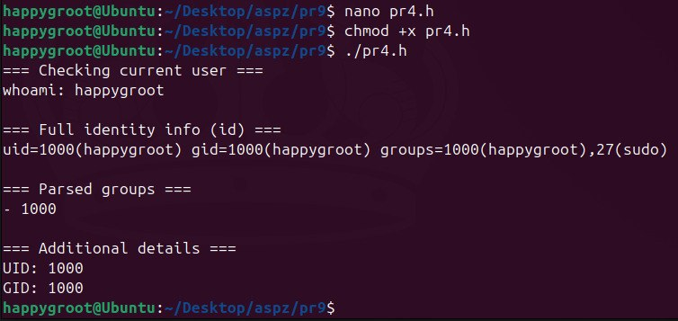

**Висновок:**
Опановано інструменти діагностики користувацького контексту та перевірки приналежності до додаткових груп доступу.

---

## Завдання 9.5: Динамічна зміна власника та прав доступу (chown/chmod)

**Опис:**
Створення тестового файлу з подальшою зміною його власника та прав через `sudo` для перевірки доступу на читання та запис.

**Пояснення:**
Скрипт створює файл у `/tmp` і визначає функцію `test_access()`, яка емпірично перевіряє можливість читання (через `cat`) та запису (через перенаправлення `>>`). Далі скрипт послідовно застосовує `sudo chown root:root` та різні маски `chmod` (644, 444, 666). Після кожної зміни викликається функція тестування. Це дозволяє наочно побачити, як система блокує запис, коли власником є `root` (маски 644/444), але знову дозволяє його, коли файл стає доступним усім для запису (маска 666) або коли користувачу повертають право власності.

**Скріншоти:**

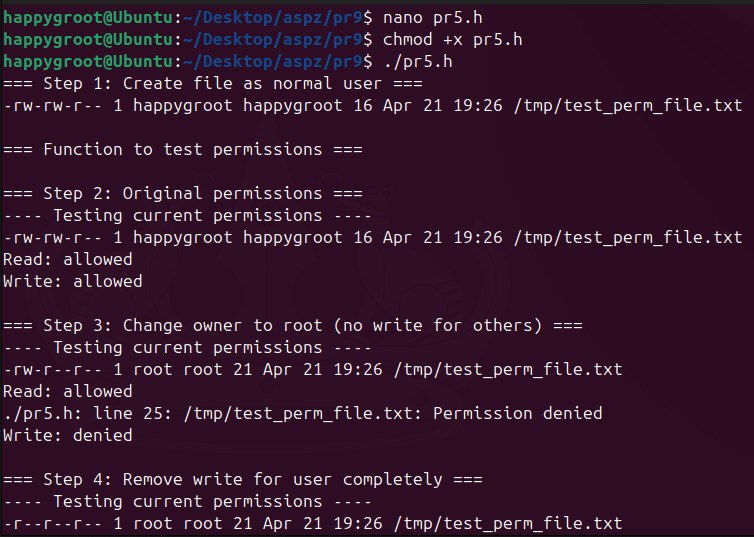
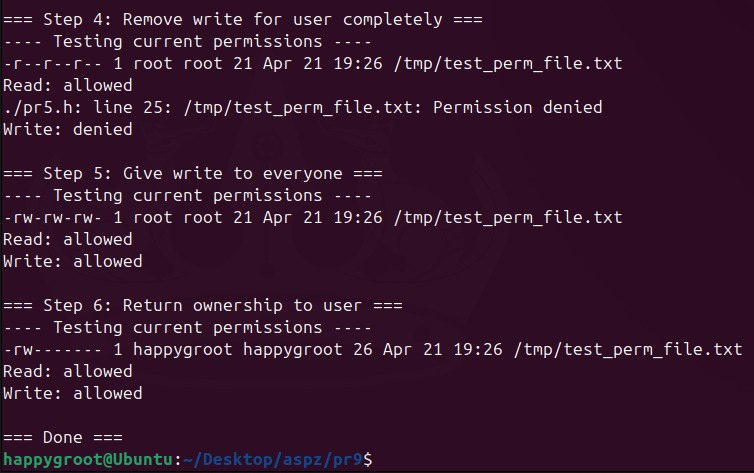

**Висновок:**
Продемонстровано гнучкість системи POSIX-прав: дозволи визначаються суворо за маскою файлу та ідентифікаторами користувача.

---

## Завдання 9.6: Аудит прав у домашньому та системних каталогах

**Опис:**
Скрипт, який перевіряє права доступу у `$HOME`, `/usr/bin` та `/etc`, роблячи спроби читання, запису та виконання файлів.

**Пояснення:**
Використовуючи `ls -l`, скрипт виводить метадані директорій. Далі він обирає по одному файлу в кожній директорії і тестує їх. У `$HOME` всі дії (читання, запис, виконання) проходять успішно (або обмежуються лише маскою самого файлу). В `/usr/bin` читання та виконання зазвичай дозволені (оскільки це бінарні файли для загального використання), але запис суворо заборонено. В `/etc` читання файлів конфігурації (наприклад, `passwd`) дозволено, запис — заборонено, а спроба виконання завершується помилкою (оскільки це текстові файли без біта `x`).

**Скріншоти:**

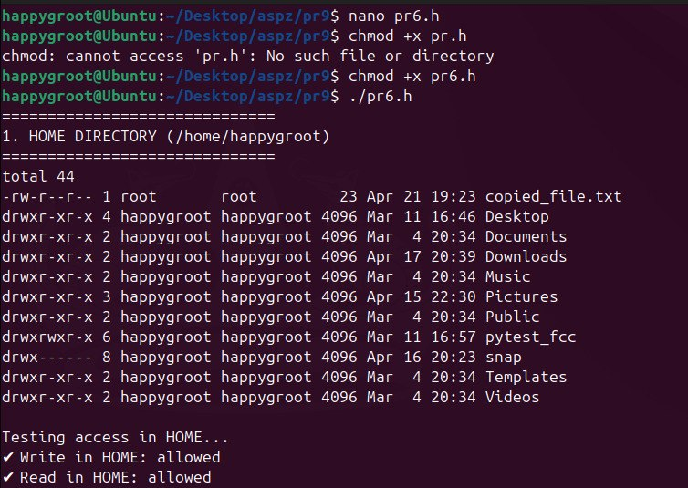
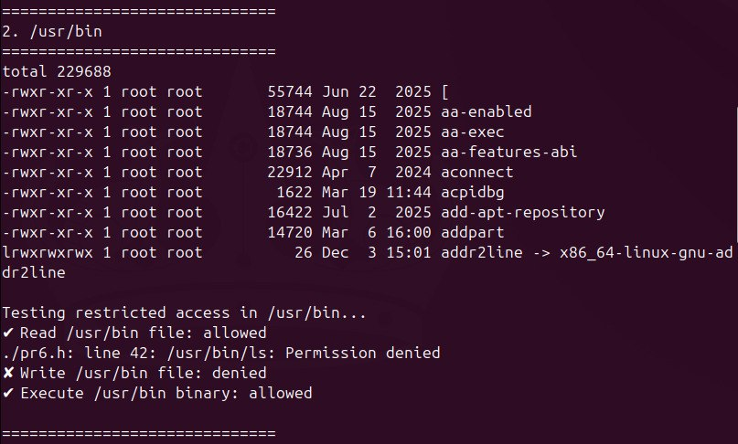
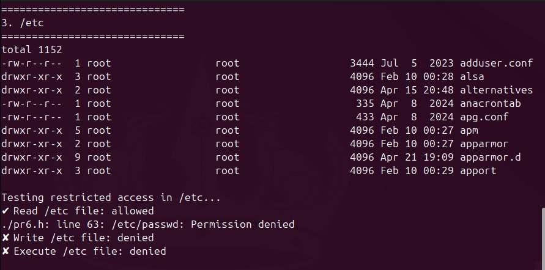
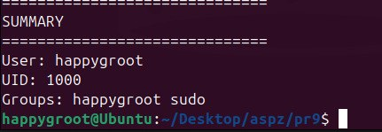

**Висновок:**
Наочно досліджено базову ієрархію файлової системи Linux та політики безпеки за замовчуванням: свобода дій користувача ізольована його домашнім каталогом.

---

## Завдання 10.13: Створення "обманної" утиліти ls (Wrapper / Trojan)

**Опис:**
Скрипт, який мімікрує під стандартну команду `ls`, перехоплюючи аргументи та логуючи дії користувача перед виконанням справжньої команди.

**Пояснення:**
Скрипт діє як обгортка (wrapper). Він перехоплює всі передані аргументи (`$@`), ім'я поточного користувача (`$USER`) та системний час, записуючи їх у прихований файл `/tmp/fake_ls_audit.log`. Основною особливістю є те, що після логування скрипт викликає `/bin/ls "$@"` за *абсолютним шляхом*. Це критично важливо для уникнення нескінченної рекурсії (якщо скрипт названо `ls` і він лежить в директорії, пріоритетній у `$PATH`). 

*Як виявити:* Таку програму можна виявити за допомогою команди `which ls` (яка покаже шлях не до `/bin/ls`), команди `alias` (якщо підміна зроблена через аліас), або перевіркою хеш-сум системних бінарників.

**Скріншоти:**

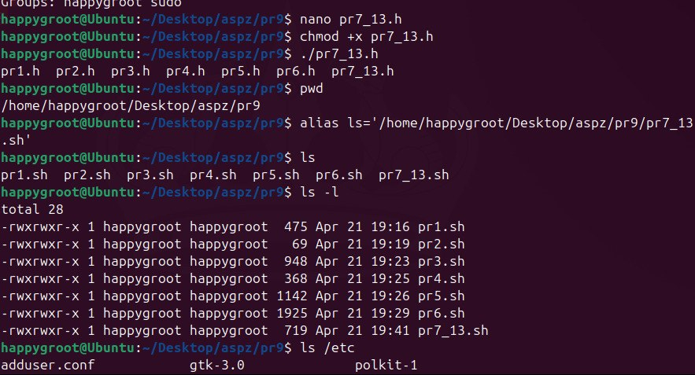
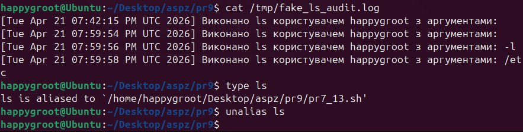

**Висновок:**
Продемонстровано небезпеку підміни виконуваних файлів та важливість контролю змінної оточення `$PATH` в контексті системної безпеки.
